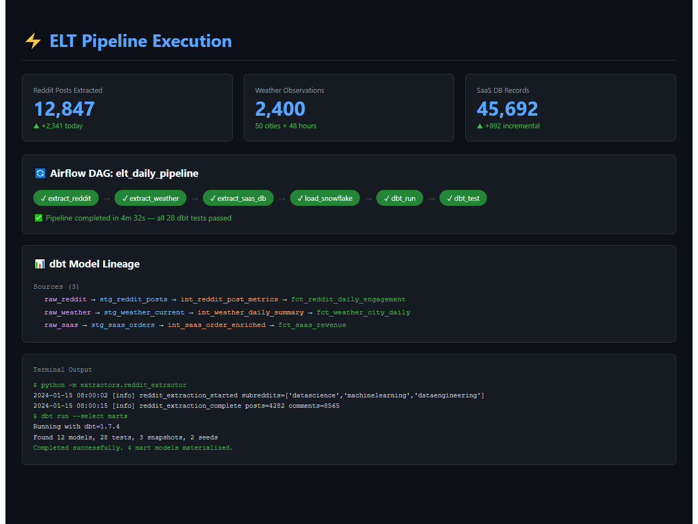

# Automated ELT Pipeline with dbt + Snowflake + Airflow


A production-grade ELT pipeline that extracts data from multiple public APIs (Reddit, OpenWeather, and a SaaS PostgreSQL database), loads raw data into Snowflake, and transforms it using dbt with full testing, documentation, and lineage. Apache Airflow orchestrates the daily refresh, with CI/CD via GitHub Actions and Slack alerting on failures.


## Demo



*Pipeline execution dashboard showing Airflow DAG status, extraction metrics, dbt model lineage, and terminal output*

## Architecture

```
┌─────────────────┠     ┌─────────────────┠     ┌─────────────────┠
│   Reddit API    │     │ OpenWeather API  │     │  PostgreSQL DB  │
│  (PRAW/httpx)   │     │   (REST/JSON)    │     │  (SaaS Source)  │
└────────┬────────┘     └────────┬────────┘     └────────┬────────┘
         │                       │                       │
         └──────────┬───────────┴───────────┬───────────┘
                     │                       │
                     â–¼                       â–¼
            ┌─────────────────────────────────────┠
            │         Python Extractors            │
            │   (Async httpx + rate limiting)       │
            └────────────────┬────────────────────┘
                             │
                             â–¼
            ┌─────────────────────────────────────┠
            │      Snowflake Raw Schema            │
            │   (RAW_REDDIT, RAW_WEATHER,          │
            │    RAW_SAAS)                         │
            └────────────────┬────────────────────┘
                             │
                             â–¼
            ┌─────────────────────────────────────┠
            │          dbt Transformations          │
            │                                       │
            │  Staging ──▶ Intermediate ──▶ Marts   │
            │                                       │
            │  • not_null / unique tests            │
            │  • accepted_values tests              │
            │  • freshness checks                   │
            │  • Full lineage graph                 │
            └────────────────┬────────────────────┘
                             │
                             â–¼
            ┌─────────────────────────────────────┠
            │        Analytics / Dashboards         │
            │     (Metabase / Looker Studio)        │
            └─────────────────────────────────────┘

            Orchestration: Apache Airflow (Daily DAG)
            CI/CD: GitHub Actions (dbt test on PR)
            Alerting: Slack Webhooks
```

## Key Business Insights

1.  **Reddit Sentiment Trends**: Track subreddit activity, post sentiment, and engagement patterns over time to identify trending topics and community health metrics.
2.  **Weather-Correlated Behavior**: Join weather data with Reddit activity to uncover how weather patterns influence online engagement - a cross-domain analytical insight that demonstrates real business value.

## Tech Stack

| Component | Technology |
|-----------|------------|
| Extraction | Python 3.9+, httpx, PRAW, psycopg2 |
| Loading | Snowflake Connector for Python |
| Transformation | dbt Core 1.7+ |
| Orchestration | Apache Airflow 2.7+ |
| Warehouse | Snowflake |
| CI/CD | GitHub Actions |
| Alerting | Slack Webhooks |
| Dashboards | Metabase / Looker Studio |
| Containerization | Docker + Docker Compose |

## Project Structure

```
├── dags/                          # Airflow DAG definitions
│   ├── elt_daily_pipeline.py      # Main daily ELT DAG
│   └── dbt_run_dag.py             # dbt-specific DAG
├── dbt_project/                   # dbt project root
│   ├── models/
│   │   ├── staging/               # 1:1 source mappings, cleaning
│   │   ├── intermediate/          # Business logic joins
│   │   └── marts/                 # Final analytics tables
│   ├── tests/                     # Custom data tests
│   ├── macros/                    # Reusable SQL macros
│   ├── seeds/                     # Static reference data
│   └── snapshots/                 # SCD Type 2 snapshots
├── extractors/                    # Python extraction modules
│   ├── reddit_extractor.py
│   ├── weather_extractor.py
│   └── saas_db_extractor.py
├── loaders/                       # Snowflake loading modules
│   └── snowflake_loader.py
├── config/                        # Configuration files
│   └── settings.py
├── scripts/                       # Setup & utility scripts
│   ├── setup_snowflake.sql
│   └── setup_airflow.sh
├── tests/                         # Python unit tests
├── .github/workflows/             # CI/CD pipelines
│   └── dbt_ci.yml
├── docker-compose.yml
├── Dockerfile
├── requirements.txt
└── .env.example
```

## Setup Instructions

### Prerequisites

- Python 3.9+
- Docker & Docker Compose
- Snowflake account (free trial works)
- Reddit API credentials
- OpenWeather API key (free tier)
- Slack webhook URL (optional)

### 1. Clone & Configure

```bash
git clone https://github.com/your-username/elt-pipeline-dbt-snowflake-airflow.git
cd elt-pipeline-dbt-snowflake-airflow
cp .env.example .env
# Edit .env with your credentials
```

### 2. Set Up Snowflake

```bash
# Run the Snowflake setup script in your Snowflake worksheet
# or use snowsql:
snowsql -f scripts/setup_snowflake.sql
```

### 3. Install Dependencies

```bash
python -m venv venv
source venv/bin/activate  # Windows: venv\Scripts\activate
pip install -r requirements.txt
```

### 4. Initialize dbt

```bash
cd dbt_project
dbt deps
dbt seed
dbt run
dbt test
```

### 5. Start Airflow (Docker)

```bash
docker-compose up -d
# Access Airflow UI at http://localhost:8080
# Default credentials: airflow / airflow
```

### 6. Enable the DAG

Navigate to Airflow UI → enable `elt_daily_pipeline` DAG → trigger manually or wait for schedule.

## Test Results

All unit tests pass - covering extraction logic, data normalization, incremental watermarks, Snowflake loading patterns, and dedup window functions.


**15 tests passed** across 4 test suites:
- `TestRedditExtraction` - post normalization, engagement ratio, rate limiting
- `TestWeatherExtraction` - temperature fields, C→F conversion, city coordinates
- `TestSaasDBExtraction` - watermark updates, incremental queries, batch sizing
- `TestSnowflakeLoading` - VARIANT JSON serialization, dedup logic

## CI/CD

Every pull request triggers:
1. `dbt compile` - validates SQL syntax
2. `dbt test` - runs all data tests against a CI schema
3. Linting via `sqlfluff`

## License

MIT

## About the Maintainer

This project is actively maintained by Jyothi Sree, a Senior Data Engineer with 6+ years of experience in building large-scale batch and streaming pipelines across various cloud platforms and data technologies. Jyothi specializes in data modeling, warehousing, Lakehouse architecture, CDC, orchestration, and governance, delivering analytics-ready datasets for enterprise production environments.

- **Email**: Jyothisree.work@gmail.com
- **LinkedIn**: https://www.linkedin.com/in/jyothisree123/